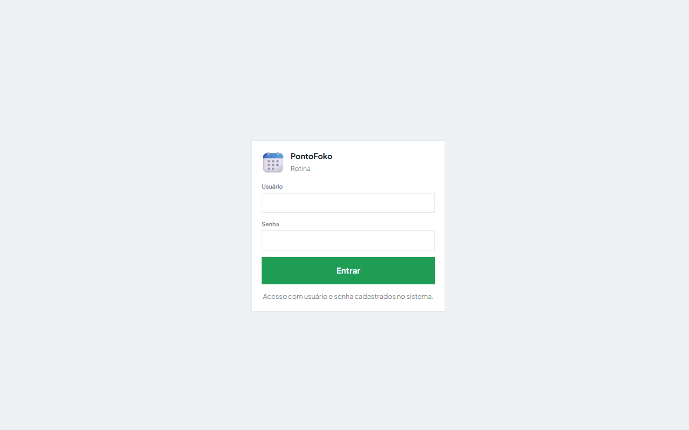
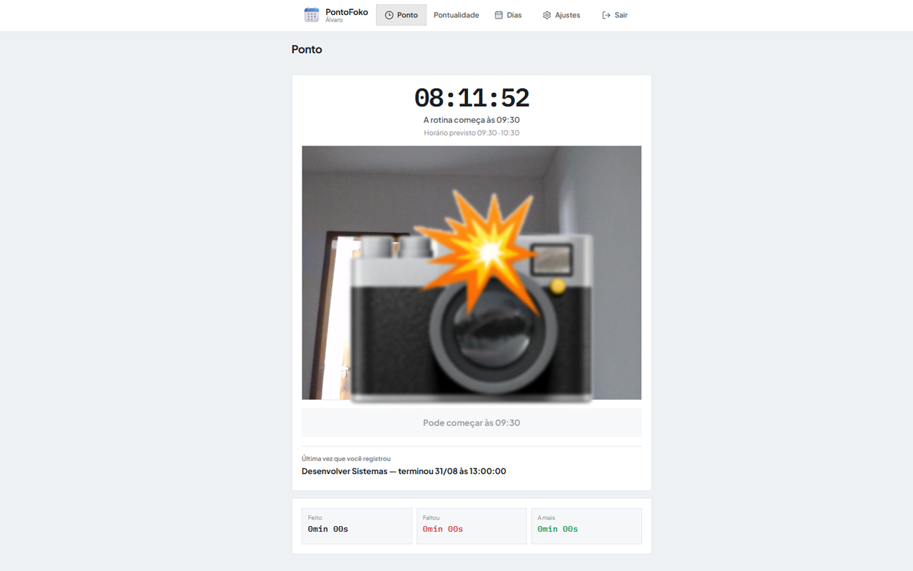
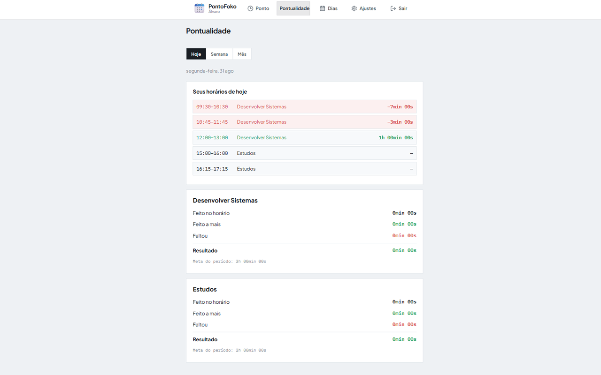
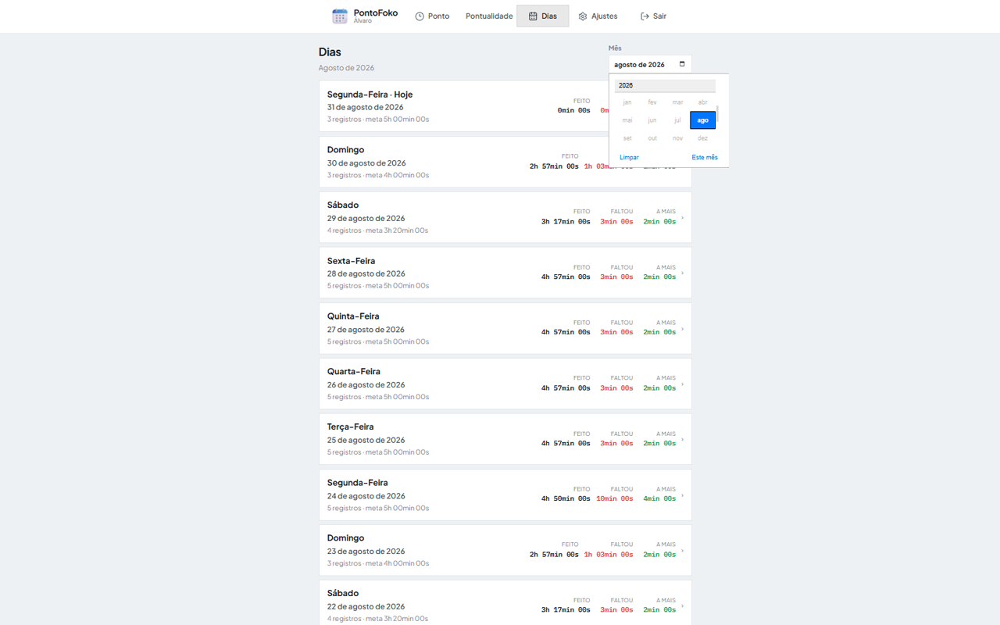
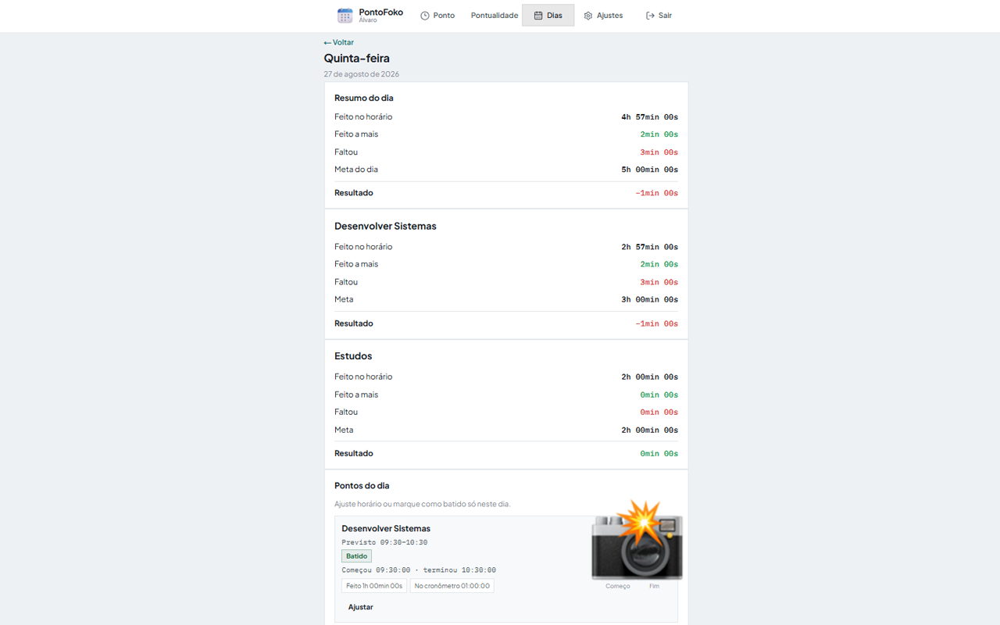
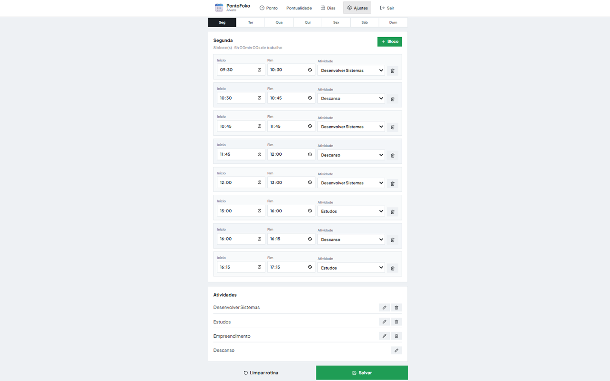

# PontoFoko

App para organizar e cumprir uma rotina semanal pessoal no formato de relógio de ponto. Você define o que vai fazer e em quais horários, registra entrada e saída com webcam, e acompanha se está cumprindo o plano.

---

## O que você consegue fazer

- Montar a **agenda da semana** (blocos de trabalho e descanso por dia)
- **Bater ponto** com horário exato e foto da webcam na entrada e na saída
- Ver **em tempo real** em qual bloco está, se atrasou ou está em descanso
- Acompanhar **horas**: meta, feito, faltou e tempo a mais — por dia, semana e mês
- Consultar o **histórico** de qualquer dia, com fotos dos registros
- **Corrigir** um ponto esquecido ou errado (só naquele dia), com observação
- **Pausar** a rotina, mudar horários e renomear atividades quando precisar

Não existe cadastro público: cada pessoa usa uma **conta criada manualmente** no banco (veja abaixo).

---

## Como funciona

### Rotina

Cada dia da semana tem blocos ordenados: início, fim, nome da atividade e se é descanso ou trabalho.

- **Trabalho** — entra na meta de horas e exige ponto
- **Descanso** — aparece na agenda e avisa quando acabar; não entra na meta

Tudo isso se configura em **Ajustes**. A rotina só vale depois de **salvar** e de chegar a **data de início** que você escolher. Até lá, dá para montar a agenda sem contar faltas.

Você também pode **pausar** a rotina (para viajar, folgar etc.). O histórico antigo permanece; só impede bater ponto novo enquanto estiver pausado.

### Bater ponto

Na tela **Ponto**:

1. O app mostra o relógio, o bloco atual e uma mensagem (no horário, atrasado, descanso, próximo bloco…)
2. A câmera liga quando precisa registrar
3. Você toca em **Começar [atividade]** na entrada e **Terminar [atividade]** na saída
4. Cada par entrada/saída vira um **registro** daquele bloco naquele dia

Cada registro guarda:

- Horário real de começo e fim
- Foto do começo e foto do fim (quando a câmera funcionou)
- Atividade e horário **previstos** do bloco (para comparar depois)

Regras:

- Só dá para começar a partir do horário previsto do bloco
- Uma sessão aberta por vez
- Se o relógio passar para outro bloco de trabalho com sessão aberta, a anterior é encerrada sozinha
- Com rotina pausada ou antes da data de início, não dá para bater ponto

### Horas e pontualidade

O app compara o **planejado** com o **registrado**:

| | |
|---|---|
| **Meta** | Total de horas de trabalho que você se propôs no período |
| **Feito** | Tempo que você registrou dentro do horário previsto |
| **Faltou** | Tempo que deveria ter sido feito e não foi |
| **A mais** | Tempo além do fim previsto (contado até o próximo bloco) |
| **Resultado** | Feito + a mais, menos o que já “venceu” no dia (saldo justo enquanto o dia ainda corre) |

Em **Pontualidade** você vê:

- Resumo do **dia**, da **semana** e do **mês**
- Detalhe **por atividade** (Emprego Dev, Estudo, etc.)
- A **agenda de hoje** bloco a bloco, com o que já foi batido ou faltou

### Histórico e fotos

Em **Dias** você navega mês a mês e abre qualquer dia passado (desde a sua data de início).

No detalhe do dia aparece:

- **Resumo** — feito, faltou, a mais, meta e resultado do dia
- **Por atividade** — mesmas métricas separadas por nome
- **Lista de pontos** — cada bloco da rotina daquele dia, com status:
  - não batido
  - batido (pelo app, manual ou ajustado depois)
  - em andamento (se ainda estiver aberto)
- **Miniaturas das fotos** de começo e fim; toque para ver em tamanho maior
- **Horários** previstos vs. reais (começo e fim)
- **Observação** — texto que você deixou ao corrigir um ponto

Na lista do mês, cada dia mostra quantos registros teve e um resumo rápido de feito / faltou / meta.

### Corrigir e acompanhar mudanças

Esqueceu de bater ou errou o horário? Em **Dias** → abra o dia → **Marcar como batido** ou **Ajustar**:

- Informe começo e fim **só para aquele dia**
- Opcional: uma **observação** (ex.: “esqueci de bater; fiz das 11h às 12h”)
- O app recalcula as horas do dia na hora

Registros feitos assim aparecem como **manual** ou **ajustado**, diferente dos batidos ao vivo pela câmera. Pontos antigos continuam no histórico mesmo se você mudar a rotina depois nos Ajustes.

Nos **Ajustes** também dá para:

- Editar blocos de qualquer dia da semana (antes de salvar, fica em rascunho)
- Criar e renomear **atividades** (o nome novo reflete no histórico se renomear)
- Mudar **data de início** ou **pausar/retomar**

---

## Telas

As capturas abaixo usam **dados apenas demonstrativos** — horários, atividades, métricas e fotos foram montados para ilustrar como o app funciona na prática. **Não representam a rotina real de nenhum usuário.**

| Tela | O que tem |
|------|-----------|
| **Ponto** | Relógio, status do bloco, câmera, começar/terminar, resumo do dia (feito / faltou / a mais) |
| **Pontualidade** | Métricas dia/semana/mês, por atividade, agenda de hoje |
| **Dias** | Calendário mensal, detalhe do dia, fotos, ajuste de ponto |
| **Ajustes** | Rotina semanal, atividades, data de início, pausa |

### Login



### Ponto



### Pontualidade



### Dias





### Ajustes



---

## Fluxo de uso

1. Entrar com usuário e senha
2. Montar a rotina e a data de início em **Ajustes**, salvar e retirar a pausa
3. No dia a dia, usar **Ponto** para registrar cada bloco
4. Acompanhar evolução em **Pontualidade**
5. Rever dias anteriores, fotos e correções em **Dias**

---

## Como criar usuários

O login é fixo no banco — **não há tela de cadastro** no app. Quem administra o projeto cria as contas pelo terminal, com o banco já configurado e o arquivo `.env.local` apontando para o Supabase (`DATABASE_URL` ou `DIRECT_URL`).

### Criar uma conta nova

```bash
npm run db:user -- <usuario> <senha> "Nome para exibir"
```

Exemplo:

```bash
npm run db:user -- maria minhasenha123 "Maria Silva"
```

O usuário nasce **zerado**:

- Sem rotina (dias vazios)
- Só a atividade “Descanso” na lista
- Rotina **pausada**
- Sem data de início

A pessoa entra, vai em **Ajustes**, monta a semana, define quando começa e salva.

Se o usuário **já existir**, o comando avisa e não sobrescreve a senha. Para atualizar senha ou perfil, use o mesmo comando após ajustar o script ou direto no banco.

---

## Tecnologias

Next.js, TypeScript, Supabase (banco e armazenamento de fotos).
